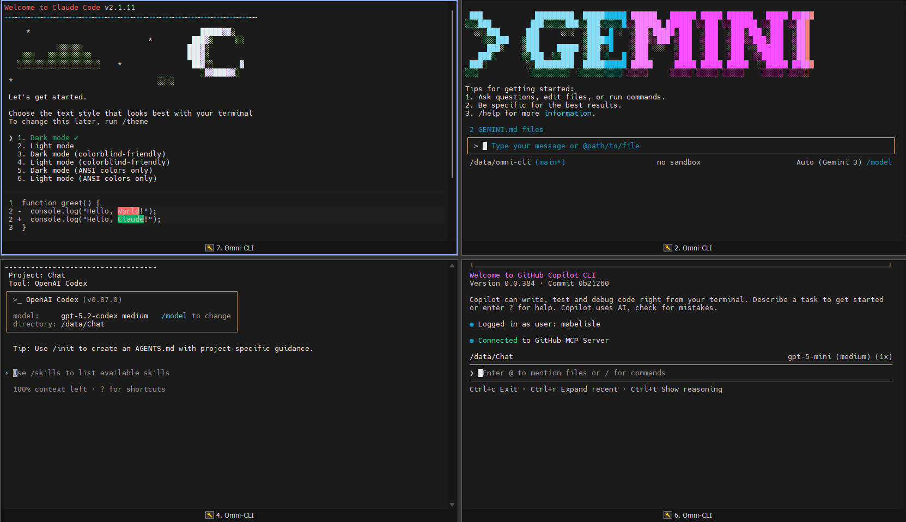
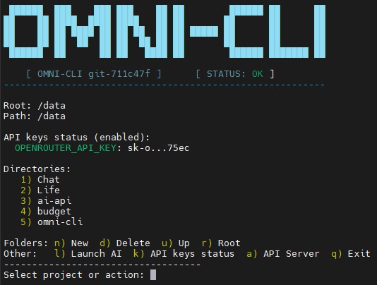

# Omni-CLI: All-in-One AI CLI Hub over SSH


**Omni-CLI** is a Dockerized SSH workspace that bundles multiple AI CLIs in one place. Connect once and use **Gemini**, **Codex**, **Copilot**, **Claude**, and **OpenCode** without installing anything on your laptop. Your tools and configs live in a single remote workspace, so you do not need to log in on every device.

Think of it as an all-in-one AI CLI cockpit you can reach from anywhere over SSH.

---

## 📸 Screenshots




---

## 🚀 Features

*   **🔑 SSH-First Workflow:** Connect remotely and launch AI CLIs immediately.
*   **🤖 Preinstalled Agents:** **Gemini**, **Codex**, **Copilot**, **Claude**, and **OpenCode** are ready out of the box.
*   **💾 Persistent Workspace:** Projects and auth/config live in Docker volumes, not on each device.
*   **🧭 Unified Menu:** The `omni-cli` dashboard navigates nested folders, shows breadcrumbs, and launches tools.
*   **🔒 Isolated Runtime:** Everything runs in Docker, keeping your host clean.
*   **👤 Smart UID/GID Mapping:** Avoids permission issues on mounted volumes.
*   **🗝️ API Key Status:** Quick status panel for configured API keys.
*   **🔌 OpenAI-Style API:** Local HTTP server that proxies chat completions to Codex or Gemini.

---

## 📋 Prerequisites

*   [Docker Engine](https://docs.docker.com/get-docker/) installed on your machine.
*   [Docker Compose](https://docs.docker.com/compose/install/) (Optional, but recommended for easier management).

---

## 🛠️ Quick Start

Get up and running in seconds.

### 1. Start
Create a `docker-compose.yml` file (or clone the repo) and start the service:

```bash
# Start the container in the background
docker-compose up -d
```

Or pull the prebuilt image and run it directly:

```bash
docker pull ghcr.io/mabelisle/omni-cli:main

docker run -d \
  --name omni-cli \
  -p 2222:22 \
  -v $(pwd)/omni-data:/data \
  -v $(pwd)/omni-config:/config \
  -e PUID=$(id -u) \
  -e PGID=$(id -g) \
  ghcr.io/mabelisle/omni-cli:main
```

### 2. Connect
Access the environment via SSH (Password: `changeme`):

```bash
ssh omni@localhost -p 2222
```

*🎉 You are now inside Omni-CLI. The AI menu launches automatically and tools are ready to use.*

---

## ⚙️ Configuration

You can customize the environment by setting environment variables in your `docker-compose.yml` or `docker run` command.

### Environment Variables

| Variable | Default | Description |
| :--- | :--- | :--- |
| `PUID` | `1000` | **User ID**. Set this to your host user's UID (run `id -u`) to ensure you have write access to mounted volumes. |
| `PGID` | `1000` | **Group ID**. Set this to your host user's GID (run `id -g`). |
| `USER_PASS`| `changeme`| **SSH Password**. The password for the `omni` user (only effective if set during build via `--build-arg`). |
| `TZ` | `UTC` | **Timezone**. Set container timezone (e.g., `America/New_York`). |
| `CODEX_PASSTHROUGH_PORT` | `8000` | **API Server Port**. Port exposed by the Codex/Gemini passthrough server. |
| `CODEX_TIMEOUT_SECONDS` | `300` | **API Timeout**. Max runtime for Codex/Gemini requests. |

### Volumes

| Volume | Internal Path | Description |
| :--- | :--- | :--- |
| `data` | `/data` | **Workspace Storage**. Maps to your local project directory. |
| `config`| `/config` | **Tool Configs**. Persists npm caches, auth tokens, and CLI settings. |

---

## 📦 Deployment Options

### Option A: Docker Compose (Recommended)

Create a `docker-compose.yml` file:

```yaml
version: '3.8'
services:
  omni-cli:
    build: .
    container_name: omni-cli
    environment:
      - PUID=1000 # Change to $(id -u)
      - PGID=1000 # Change to $(id -g)
      - TZ=UTC
    volumes:
      - ./omni-data:/data
      - ./omni-config:/config
    ports:
      - "2222:22"
    restart: unless-stopped
```

### Option B: Docker CLI (Pull Image)

```bash
docker run -d \
  --name omni-cli \
  -p 2222:22 \
  -v $(pwd)/omni-data:/data \
  -v $(pwd)/omni-config:/config \
  -e PUID=$(id -u) \
  -e PGID=$(id -g) \
  ghcr.io/mabelisle/omni-cli:main
```

### Option C: Docker CLI (Build Locally)

```bash
docker build -t omni-cli .

docker run -d \
  --name omni-cli \
  -p 2222:22 \
  -v $(pwd)/omni-data:/data \
  -v $(pwd)/omni-config:/config \
  -e PUID=$(id -u) \
  -e PGID=$(id -g) \
  omni-cli
```

---

## 🏗️ Architecture

### The Entrypoint Logic
The `entrypoint.sh` script is the brain of the container initialization:
1.  **Permission Fix:** It checks the `PUID` and `PGID` env vars and modifies the internal `omni` user to match them.
2.  **Key Gen:** Generates SSH host keys if they are missing.
3.  **Privilege Drop:** While it runs as `root` to perform setup, it executes the final command (or starts the SSH daemon) as the unprivileged `omni` user (or drops privileges appropriately) to ensure security.

### The Menu Interface (`omni-cli.sh`)
When you log in, `omni-cli.sh` is sourced. It provides an ASCII-art menu to:
*   Navigate folders and subfolders in `/data` with breadcrumb paths.
*   Create/Delete folders.
*   Launch context-aware AI sessions within those folders (**Gemini**, **Codex**, **Copilot**, **Claude**, **OpenCode**).
*   View API key status.

---

## 💡 Usage & Authentication

**Important:** Omni-CLI provides the *environment* and *tools*, but **you must provide the access**.

Each AI CLI (**Gemini**, **Codex**, **Copilot**, **Claude**, **OpenCode**) is pre-installed software that requires its own authentication. When you launch a tool for the first time, you will typically be prompted to login or provide an API key.

### Pro Tip: The "Free Tier" Rotation 🔄
There are plenty of ways to get free AI access using these tools! Since you have all of them at your fingertips:
1.  Start with your preferred agent.
2.  If you hit a rate limit or a free tier cap, simply **switch to the next one** in the menu.
3.  Cycle through **Gemini**, **Codex**, **Copilot**, **Claude**, and **OpenCode** to maximize your productivity without needing a paid subscription for every single service.

### OpenCode Provider Environment Variables

OpenCode can read provider credentials from environment variables. These are the variables documented at https://opencode.ai/docs/providers/.

| Provider | Environment Variables |
| :--- | :--- |
| **SAP AI Core** | `AICORE_SERVICE_KEY`, `AICORE_DEPLOYMENT_ID`, `AICORE_RESOURCE_GROUP` |
| **Anthropic** | `ANTHROPIC_API_KEY` |
| **Amazon Bedrock** | `AWS_ACCESS_KEY_ID`, `AWS_SECRET_ACCESS_KEY`, `AWS_REGION`, `AWS_PROFILE`, `AWS_BEARER_TOKEN_BEDROCK`, `AWS_WEB_IDENTITY_TOKEN_FILE`, `AWS_ROLE_ARN` |
| **Azure OpenAI** | `AZURE_RESOURCE_NAME` |
| **Azure Cognitive Services** | `AZURE_COGNITIVE_SERVICES_RESOURCE_NAME` |
| **Cloudflare AI Gateway** | `CLOUDFLARE_ACCOUNT_ID`, `CLOUDFLARE_GATEWAY_ID`, `CLOUDFLARE_API_TOKEN` |
| **GitLab Duo** | `GITLAB_INSTANCE_URL`, `GITLAB_TOKEN`, `GITLAB_AI_GATEWAY_URL`, `GITLAB_OAUTH_CLIENT_ID` |
| **Google Vertex AI** | `GOOGLE_APPLICATION_CREDENTIALS`, `GOOGLE_CLOUD_PROJECT`, `VERTEX_LOCATION` |

---

## 🔌 API Passthrough (OpenAI-Style)

Omni-CLI starts a lightweight Node.js HTTP server (`api.js`) inside the container that **proxies chat completions to your installed CLI tools** (Codex or Gemini). It exposes fully OpenAI-compatible endpoints, allowing you to use the same API structure as OpenAI's official API, but with your local models.

### How It Works

The API server acts as a **translation layer**:

1.  **Receives** OpenAI-formatted requests (`POST /v1/chat/completions`)
2.  **Translates** the request into CLI commands
3.  **Executes** the appropriate CLI tool (`codex` or `gemini`)
4.  **Returns** an OpenAI-compatible response

**Translation Flow:**
```
OpenAI Request → api.js → CLI execution → Response parsing → OpenAI Response
```

**Key Features:**
- **Model Aliasing**: `codex-default` and `gemini-default` aliases
- **OpenRouter Integration**: Automatically discovers and verifies OpenRouter models when `OPENROUTER_API_KEY` is set
- **Smart Routing**: Automatically routes to Codex or Gemini based on model name pattern
- **Temporary Workspaces**: Runs each request in isolated temporary directories
- **Timeout Protection**: Configurable timeout (default 300s) prevents hanging requests

### Endpoints

| Endpoint | Method | Description |
|----------|--------|-------------|
| `/` | GET | Health check |
| `/v1/models` | GET | Model catalog (list of available models) |
| `/v1/chat/completions` | POST | Chat completions (OpenAI-compatible) |

### 1. Expose the API Port

Map the default port `8000` (or the value of `CODEX_PASSTHROUGH_PORT`) when you run the container:

```bash
docker run -d \
  --name omni-cli \
  -p 2222:22 \
  -p 8000:8000 \
  -v $(pwd)/omni-data:/data \
  -v $(pwd)/omni-config:/config \
  -e PUID=$(id -u) \
  -e PGID=$(id -g) \
  ghcr.io/mabelisle/omni-cli:main
```

Docker Compose:

```yaml
ports:
  - "2222:22"
  - "8000:8000"
```

### 2. Using the API

#### Basic Chat Completion

```bash
curl http://localhost:8000/v1/chat/completions \
  -H "Content-Type: application/json" \
  -d '{
    "model": "codex-default",
    "messages": [
      { "role": "user", "content": "Write a haiku about SSH." }
    ]
  }'
```

**Response:**
```json
{
  "id": "chatcmpl-abc123",
  "object": "chat.completion",
  "created": 1234567890,
  "model": "codex-default",
  "choices": [
    {
      "index": 0,
      "message": {
        "role": "assistant",
        "content": "Secure shell flows,\nEncrypted tunnel connects,\nRemote access blooms."
      },
      "finish_reason": "stop"
    }
  ],
  "usage": {
    "prompt_tokens": 0,
    "completion_tokens": 0,
    "total_tokens": 0
  }
}
```

#### Multi-Turn Conversation

```bash
curl http://localhost:8000/v1/chat/completions \
  -H "Content-Type: application/json" \
  -d '{
    "model": "gemini-2.5-pro",
    "messages": [
      { "role": "user", "content": "What is Docker?" },
      { "role": "assistant", "content": "Docker is a platform for developing, shipping, and running applications in containers." },
      { "role": "user", "content": "What is the difference between Docker and Kubernetes?" }
    ]
  }'
```

### 3. Listing Available Models

```bash
curl http://localhost:8000/v1/models
```

**Response:**
```json
{
  "object": "list",
  "data": [
    {
      "id": "gpt-4o",
      "object": "model",
      "created": 1234567890,
      "owned_by": "codex"
    },
    {
      "id": "gemini-2.5-pro",
      "object": "model",
      "created": 1234567890,
      "owned_by": "gemini"
    }
  ]
}
```

### 4. Model Catalog & Aliases

#### Built-in Models
The API comes with pre-configured model IDs:

**Codex Models:**
- `gpt-5.2-codex`, `gpt-5.1-codex-max`, `gpt-5.1-codex-mini`
- `gpt-5.2`, `gpt-3.5-turbo`, `gpt-4`, `gpt-4o`
- `codex-default` (alias for the best available Codex model)

**Gemini Models:**
- `gemini-3-pro-preview`, `gemini-3-flash-preview`
- `gemini-2.5-pro`, `gemini-2.5-flash`, `gemini-2.5-flash-lite`
- `gemini-2.0-flash-exp`, `gemini-2.0-flash`
- `gemini-1.5-pro-latest`, `gemini-1.5-flash-latest`
- `gemini-default` (alias for the best available Gemini model)

#### OpenRouter Integration
When you set `OPENROUTER_API_KEY` (or `OR_API_KEY`), the API will:
1. **Fetch** the OpenRouter model catalog every 24 hours
2. **Verify** each model by making a test request
3. **Add** working models to the catalog
4. **Include** OpenRouter models in `/v1/models` response

**Environment Variables:**
- `OPENROUTER_API_KEY` / `OR_API_KEY`: Your OpenRouter API key
- `OPENROUTER_MODELS_URL`: Custom models endpoint (default: `https://openrouter.ai/api/v1/models`)
- `OPENROUTER_REFRESH_MS`: Refresh interval in milliseconds (default: 24 hours)
- `OPENROUTER_VERIFY_TIMEOUT_MS`: Verification timeout (default: 20000ms)
- `OPENROUTER_VERIFY_CONCURRENCY`: Concurrent verifications (default: 3)
- `OPENROUTER_VERIFY_PROMPT`: Test prompt (default: "Reply with OK.")

### 5. Authentication & API Keys

The API server **automatically uses** the CLI tools' authentication. You don't need to set separate API keys for the passthrough server.

**Supported Provider Environment Variables:**

| Provider | Environment Variables |
| :--- | :--- |
| **Anthropic** | `ANTHROPIC_API_KEY` |
| **OpenAI** | `OPENAI_API_KEY`, `OPENAI_API_BASE` |
| **Google Gemini** | `GEMINI_API_KEY`, `GOOGLE_API_KEY` |
| **Google VertexAI** | `VERTEXAI_PROJECT`, `VERTEXAI_LOCATION` |
| **OpenRouter** | `OPENROUTER_API_KEY`, `OR_API_KEY` |
| **Groq** | `GROQ_API_KEY` |
| **Cerebras** | `CEREBRAS_API_KEY` |
| **Huggingface** | `HF_TOKEN`, `HUGGINGFACE_API_KEY` |
| **AWS Bedrock** | `AWS_ACCESS_KEY_ID`, `AWS_SECRET_ACCESS_KEY`, `AWS_REGION`, `AWS_PROFILE`, `AWS_BEARER_TOKEN_BEDROCK` |
| **Azure OpenAI** | `AZURE_OPENAI_API_KEY`, `AZURE_OPENAI_API_ENDPOINT`, `AZURE_OPENAI_API_VERSION`, `AZURE_API_KEY`, `AZURE_API_BASE`, `AZURE_API_VERSION` |

**Setting Auth in Docker:**
```bash
docker run -d \
  --name omni-cli \
  -p 2222:22 \
  -p 8000:8000 \
  -v $(pwd)/omni-data:/data \
  -v $(pwd)/omni-config:/config \
  -e PUID=$(id -u) \
  -e PGID=$(id -g) \
  -e OPENAI_API_KEY="sk-..." \
  -e GEMINI_API_KEY="AIza..." \
  -e OPENROUTER_API_KEY="sk-or-..." \
  ghcr.io/mabelisle/omni-cli:main
```

### 6. Advanced Configuration

#### Custom Workspace Root
The API uses temporary workspaces for each request. You can specify a custom base directory:

```bash
node api.js -C /path/to/workspace
```

#### Timeout Configuration
Adjust the maximum execution time for Codex/Gemini requests:

```bash
docker run -d \
  --name omni-cli \
  -e CODEX_TIMEOUT_SECONDS=600 \  # 10 minutes
  ghcr.io/mabelisle/omni-cli:main
```

#### Custom Port
Change the API server port:

```bash
docker run -d \
  --name omni-cli \
  -e CODEX_PASSTHROUGH_PORT=9000 \
  -p 9000:9000 \
  ghcr.io/mabelisle/omni-cli:main
```

### 7. Example: Using with OpenAI-Compatible Clients

Since the API is fully compatible with OpenAI's API structure, you can use it with any OpenAI-compatible client:

**Python with `openai` library:**
```python
import openai

# Point to your Omni-CLI API
openai.api_base = "http://localhost:8000/v1"

# Make a request
response = openai.ChatCompletion.create(
    model="codex-default",
    messages=[{"role": "user", "content": "Hello!"}]
)

print(response.choices[0].message.content)
```

**curl with custom base URL:**
```bash
curl http://localhost:8000/v1/chat/completions \
  -H "Content-Type: application/json" \
  -d '{"model":"gemini-default","messages":[{"role":"user","content":"Hi"}]}'
```

### 8. Debugging & Logs

The API server logs are available at `/tmp/omni-codex-server.log` inside the container:

```bash
docker exec -it omni-cli cat /tmp/omni-codex-server.log
```

For real-time monitoring:
```bash
docker logs -f omni-cli
```

### 9. Error Handling

The API returns standard HTTP status codes:
- `200`: Success
- `400`: Invalid request (bad JSON, missing messages)
- `404`: Endpoint not found
- `500`: CLI execution failed
- `504`: Request timeout

Error responses include a `detail` field with the error message:
```json
{
  "detail": "Codex execution failed: API key not found"
}
```

---

## 🤝 Contributing

Contributions are welcome! Please feel free to submit a Pull Request.

1.  Fork the Project
2.  Create your Feature Branch (`git checkout -b feature/AmazingFeature`)
3.  Commit your Changes (`git commit -m 'Add some AmazingFeature'`)
4.  Push to the Branch (`git push origin feature/AmazingFeature`)
5.  Open a Pull Request

---

## ❤️ Special Thanks

This project stands on the shoulders of giants. A huge thank you to the teams behind these amazing tools:

*   **Gemini:** [google-gemini/gemini-cli](https://github.com/google-gemini/gemini-cli)
*   **Codex:** [openai/codex](https://github.com/openai/codex)
*   **Copilot:** [github/copilot-cli](https://github.com/github/copilot-cli)
*   **Claude:** [anthropics/claude-code](https://github.com/anthropics/claude-code)
*   **OpenCode:** [opencode.ai](https://opencode.ai)

---

*Generated with ❤️ by Gemini*
